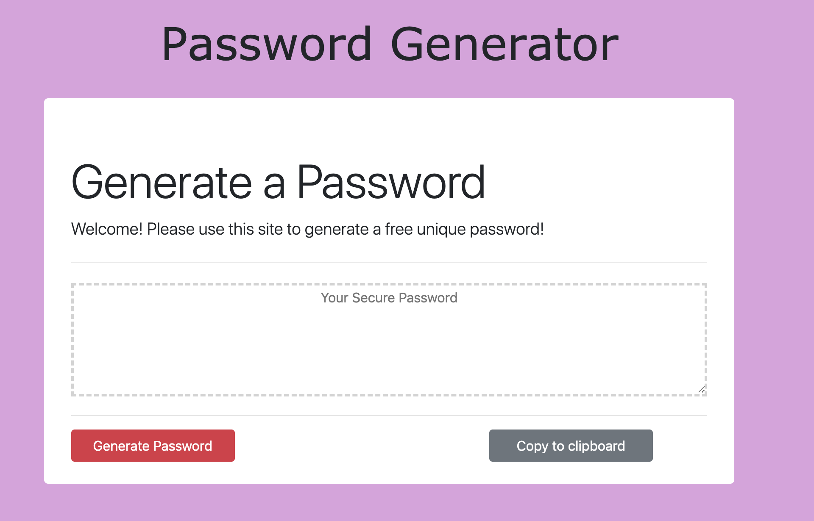

# Password Generator

# Table of Contents (Optional)
N/A

# Installation
View website. https://alexahanthony.github.io/password-generator/
View Github Repository. https://github.com/alexahanthony/password-generator

# Usage
This application generates a random password based on user-selected criteria. This app runs in the browser and features dynamically updated HTML and CSS powered by  JavaScript code.

# Credits
There were no collaborators, (other than classmates and teacher feedback).

# Third-party assets: 
https://getbootstrap.com/ for styling
https://www.w3schools.com/ for help with styling
https://stackoverflow.com/ for help with while loop

# License
N/A

# Badges
N/A

# Contributing
N/A

# Tests
N/A
